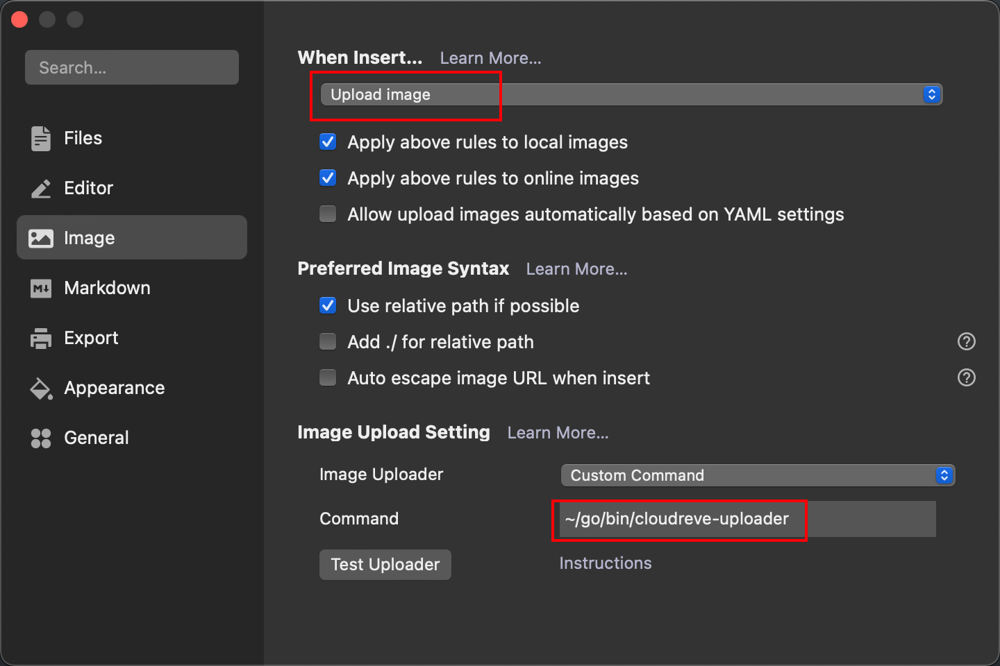

# Cloudreve uploader

A simple command line tool to help upload files to cloudreve and get direct links. It helps typora to upload images to cloudreve and use cloudreve as a image server.

## Quick Start

### pre-conditions

If you want to get a direct link to a file, you have to turn on the feature in the storage policy that allows for direct links to be obtained

### Install:

If you have already installed golang

```sh
go install github.com/vincent-vinf/cloudreve-uploader
```

cloudreve-uploader will be installed on `$GOPATH/cloudreve-uploader ` or `$HOME/go/bin/cloudreve-uploader`(GOBIN environment variable not specified).

Alternatively, you can download the executable directly from the release.

### config

```sh
# You can specify the path to the configuration file using --config=/path/to/config.yaml
# defaults to ~/.cloudreve_uploader.yaml
vi ~/.cloudreve_uploader.yaml
```

write the following

```yaml
server: https://example.com
username: <username>
password: <password>
path: <default remote path>
```

### test

```sh
/path/to/cloudreve-uploader /path/to/file
```

The program outputs some logs to stderr and outputs the corresponding direct link to the file at stdout.

### Use in typora:



1. Enable the typora upload image function
2. Set command to the path where cloudreve-uploader is located

### Other flags

```
Flags:
      --config string   config file (default "$HOME/.cloudreve_uploader.yaml")
      --direct-link     get direct link (default true)
  -h, --help            help for cloudreve-uploader
      --path string     remote path
```

## Known Issues

* Only supports uploading files, not directories
* Tested on local storage policy only, other storage policies not yet tested
